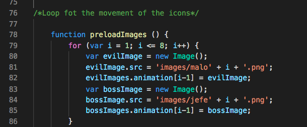
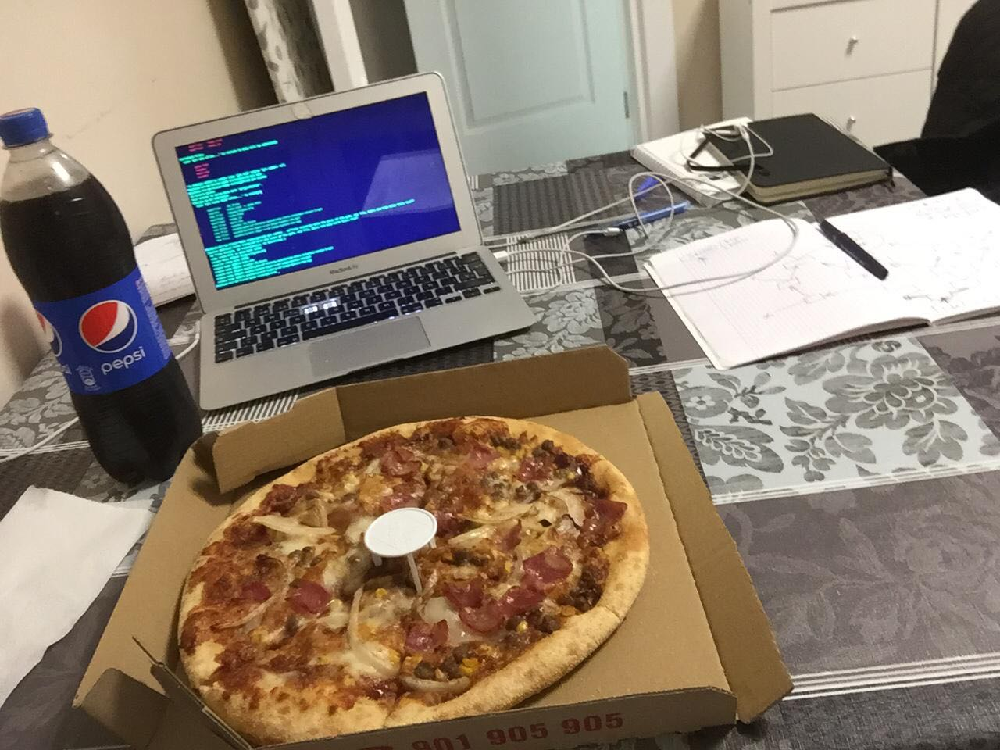

El juego de Vic
==========

El juego consta de tres pantallas
--------------------
Pantallas:
+ Bienvenida: Aquí deberas elegir la modalidad del juego, One player or Two player
+ One Player: Es un canvas en el que se desarrolla un juego básico de marcianitos que cuenta con varios niveles que al superarlos va aumentando la dificultad ligeramente hasta que te enfrentas con el malo final
+ Two Player: Un clásico tres en raya para que te diviertas contra un amigo con una 💖bella decoración💖 

Comentarios
--------------------
1. Parte de código orgulloso:
* Me siento orgulloso de, en One Player, como se mueven los bichitos, que lo he hecho con un loop y el nombre de las imagenes. Me llevo bastante tiempo.

* ✅Me he pasado la serie Sillicon Valley
* ✅He pedido bastante comida china y pizza a domicilio

2. Parte que más te ha costado y porqué:
* Pensar que iba a hacer
* Conseguir que el one player funcionara todo

3. Si volvieses a realizar el proyecto que cambiarias:
* Mejoraría los marcianitos para que se pudieran jugar en dos jugadores, siendo uno el bueno y otro el malo.

4. Mejoras con más tiempo:
* El modo dos jugadores
* La dificultad variable de los modos.
* Mejorar la estructura del código